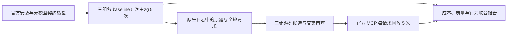

# reflex-6：官方安装重测协议

本次重新测量 zg 0.2.2 的官方安装集成。历史 v6 自定义只读桥接结果不作为本轮 baseline 或 zg 运行。

1. 固定 SWE-QA `reflex-6`、Reflex `fe0f946dc0c240c6c1e513318c21db407e191c78`，保留原题及三个必答事实。使用 OpenCode 1.18.4＋GLM5.2、OpenCode 1.18.4＋Qwen3.8-max、QoderCLI 1.1.45＋Qwen3.8-max。每组 baseline 5 次、zg 5 次，共 30 次，独立会话并按预定顺序交错。
2. 每次使用新容器及原生用户配置目录。共同模型、只读工具权限和预算配置先写入，再执行 **`zg install --target opencode --yes` 或 `zg install --target qoder --yes`**。不改安装后的 MCP 命令、配置或 guidance，不手工通过 `instructions`／`--append-system-prompt` 注入指引。安装默认 stdio／agent 工具集及原生 daemon 路径保持不变。
3. zg 运行使用官方命令设置并构建 `local/potion-code-16m-v2` 本地索引。每次新建索引，准备费用单列。业务源码只读；不覆盖原生 `autoUpdate`／freshness，记录索引身份与实际返回。因此本轮回放不宣称与全部 E2E 共用冻结索引。baseline 不执行 zg 命令，也不加载 zg 配置或 guidance。
4. 先做两个客户端的真实安装及 MCP `initialize/tools/list` 无模型检查。OpenCode 另用固定 CLI 与本地假服务验证原生全局 AGENTS 自动发现，再核对正式 E2E 首个 QA 请求中安装 guidance 实际出现一次。Qoder 保留原生自动发现配置；无法从原生流观测到的完整系统提示词标为未知，不用手工注入替代验证。
5. 正式 E2E 保留所有 30 个计划运行，包括错误、超预算、未使用 zg 和缺失计量。使用原生日志／OpenCode 模型请求记录提取调用、参数、返回及 usage；E2E 不插入 MCP 代理或自建检索服务。预算为累计 input 300000、模型请求 30、工具调用 60、900 秒，记录在途超限。
6. 运行前冻结 [答案评分文件](../../benchmarks/swe-qa-bench/cases/reflex-6.judge-official-v1.json)。它保留原题必答事实，补齐上一轮发现的源码反证及四个校准样例；两名 judge 独立评分，错误／分歧／未校准保留，原始答案不替换。判断“质量不下降”不能只凭模型 raw pass。
7. E2E 结束后，从原生日志收集原题和所有实际 zg 请求，保留完整参数、调用 ID、同轮批次、上下文与失败。未捕获 MCP RPC 的 `_meta` 等字段不编造；回放描述由已观察的工具名称和参数构成。原题单独规定 `root=/app`、`query=原题`、`limit=10`，其余使用发布版默认行为。
8. 三组独立提出查询相关的源码入口，由另两组审查，再经源码定位校验冻结共享 GroundTruth。标注运行不向被测 Agent 暴露答案或目标；未确认的标签保持 unknown。该 GroundTruth 是部分正例、模型辅助审查，不是穷尽人工 Gold。
9. 独立新容器重新执行官方安装及同配置索引构建，使用安装器产生的原样 MCP 命令，在同一个 MCP 会话／新建索引中连续回放每个唯一请求 5 次。第 1 次评价命中与排名，其余检查重复性。指标为入口 Hit@1/5/10、首命中排名、RR@10、可见文本 SHA256 一致性与错误／unknown；不将文本一致推广为完整结构化返回或独立索引构建一致，不恢复字节或窗口指标，不从重复结果中挑最高分。
10. 联合报告按组／运行／调用 ID 连接 E2E 成本、答案判定、查询变化和检索结果。相同请求在新索引上返回不同，先记录构建和运行差异，不能归咎于 Agent 随机性；不同部分正例集合的首排名也不能直接证明 query 更优。单题五次重复仅描述本轮观察，不作为普遍收益或质量非劣证明。

执行入口为 [official-install-qa.yml](../../.github/workflows/official-install-qa.yml)。旧自定义桥接 workflow 已停止执行；本轮不进行 Prompt 候选筛选或变体比较。

## 运行后的配置校验修正

CI `34922580478` 的 QoderCLI 1.1.45 会原生写入缺失的 `securityScan` 默认值：`l1StaticCheck`、`l2LightweightScan`、`l3DeepScan` 均为 `true`，并重新格式化 JSON。根据发布包源码重建配置，最终完整字节 SHA256 与 10 次记录全部匹配；其他模型、MCP、权限配置和 guidance 未变。

基准脚本不修改该原生行为。`agent_config_unchanged` 仍表示严格字节一致；独立的 `agent_config_contract_valid` 仅对 Qoder 1.1.45 接受 JSON 内容不变的格式变化，或仅追加上述原先缺失的三个默认值，其余内容须严格相同。OpenCode 仍检查字节一致。最终配置另存快照和原始 SHA256；若导出时脱敏，另记快照 SHA256。其他配置或 guidance 变化视为 contract failure，并停止继续消费该组后续试验。

历史工件不覆盖。已发生的外层失败只能通过独立离线更正记录解释：核对原生完成、终局／契约检查、源码身份、原配置及记录的最终 SHA256，全部满足后移除已知错误的执行门禁，再用相同 judge 输出与校准记录计算生效共识。这不重评分、不调用模型、不宣称原 CI 成功；也不能因此证明答案正确。
