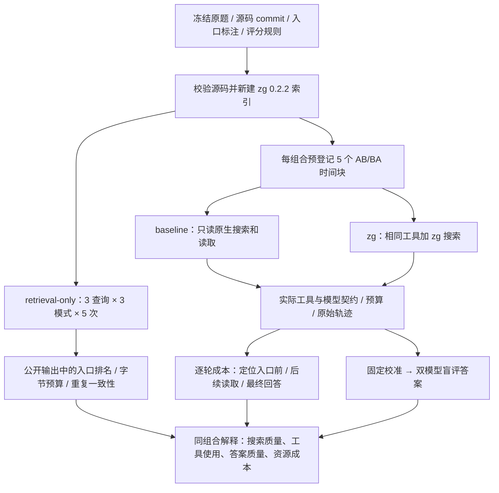

# reflex-6：可审计的 retrieval-only 与只读 E2E 协议 v3

本轮回答两个问题：**zg 能否用较少的可见结果定位正确源码入口；agent 获得 zg 后，能否保持答案质量并减少 input tokens / tool calls。** 测试对象是已发布的 `@zvec/zvec-grep@0.2.2`，不是当前开发源码。

这是同一个 case 的开发实验。入口标注和校准题是在查看旧实验后制定的；新运行用于检验冻结协议，不能把这个 case 当作盲测集，也不能据此宣称 zg 在全部软件任务上有效。

## 1. 冻结对象与执行顺序

1. 保持 SWE-QA 的 `reflex-6` 原始问题和原始九段答案证据不变，固定 Reflex commit `fe0f946dc0c240c6c1e513318c21db407e191c78`。
2. 冻结 `reflex-6.entries.json` 的源码入口、查询、输出预算和评分规则；冻结 `reflex-6.judge-v2.json` 的评分补充源码与四条校准答案。源码文件、定义和问题均校验 SHA-256。
3. 各 CI 组合从固定 commit 获取源码，验证标注后新建一次索引。使用 `local/potion-code-16m-v2`，记录权重文件哈希、索引统计、准备耗时；不跨 CI 复用索引。
4. 执行不经过 LLM 的 retrieval-only：3 个冻结查询 × FTS / vector / hybrid × 5 次，共 45 次。
5. 执行 E2E：每个组合预先登记 baseline 5 次、zg 5 次。每个时间块各一次 baseline / zg，以 seed 1729 冻结 AB / BA 顺序；每次新容器、新会话、新 agent 配置。
6. 两个模型按冻结评分规则盲评答案，先完成固定校准。汇总全部计划试验，保留失败、零次 zg 调用、缺失用量和未执行试验。
7. 保存报告、原始轨迹、实际请求与响应、逐调用 zg 事件、源码和索引完整性检查。离线分析不再次调用被测模型；改协议后的实验使用新目录，保留旧结果。

## 2. Retrieval-only 到底测什么

**主目标是入口定位，不要求搜索结果一次展示完整推理链。** 对这个问题，`ComputedVar._deps`、`DependencyTracker._populate_dependencies`、`BaseState._init_var_dependency_dicts` 都是有依据的函数入口。命中其中一个便可作为后续源码阅读起点。文件、类、函数分层计分，不能把相关文件或两千行的父类范围升级成函数命中。

| 指标 | 精确定义 | 能解释的问题 |
|---|---|---|
| 函数 Hit@1 / @5 / @10 | 原始前 K 个结果中，是否有一个可定位的主函数入口 | 有没有把有用入口放进前列 |
| First hit rank / RR@10 | 首个主入口的原始排名；前十未命中时 RR 为 0 | agent 要翻过多少结果才能定位 |
| 文件、类的同类指标 | 只使用该层级的入口标注 | 是连文件都没找到，还是找到了类却没有函数入口 |
| 可见预算下的命中 | 对同一原始公开文本截取前 4096 / 8192 UTF-8 字节，再评分；原生完整输出单独报告 | 定位信息是否藏在过长的返回中 |
| Bytes through first hit | 从公开输出开头到首个命中结果块末尾的累计字节数，包含之前的结果和说明 | 暴露入口所需的输出长度；不是模型 input tokens |
| 可选证据组覆盖 | 同组多个等价入口满足 OR；各组分别报告，不要求全部满足 | 命中了依赖发现、注册或重算的哪些环节 |
| 重复一致性与耗时 | 同一 query/mode 的五次公开文本哈希、入口排名、首轮与后四轮延迟 | 区分检索排序漂移、输出漂移和冷加载开销 |

判定只读取 agent 可见的公开返回：正确路径，加定义、可定位 outline 或精确源码锚点。提到函数名的评论、调用方的字符串、父类范围覆盖目标，都不能自动算函数入口。保留原排名，不先去重再提高排名；同一目标被多个结果召回，只对目标覆盖去重。

原始问题是主查询。另两条查询是“如何发现依赖”和“如何选择性刷新”的相关子意图探针，不能算三个独立任务。每个 query/mode 预先取第一次作质量观察，另四次用于一致性和耗时；不会把重复执行扩充成五个质量样本。

完整九段证据覆盖仍可诊断“公开返回里显示了哪些源码”，但不再作为检索成败的主判据。4096 / 8192 字节是离线比较视图，本轮 E2E 使用 zg 0.2.2 的原生返回，没有据此裁剪工具输出。

这层没有与 rg 做“相同自然语言直接输入”的伪公平比较。rg 的关键字由模型决定，这种查询构造成本在 E2E 的 baseline 中衡量。retrieval-only 负责隔离 zg 本身的入口定位与输出表现。

## 3. 三组 E2E 与真实控制

| 组合 | 原生工具 | 采样控制 | 服务身份 |
|---|---|---|---|
| OpenCode 1.18.4 + GLM-5.2 | read / grep / glob | 自定义模型启用 temperature 能力，并设置 agent temperature=0；检查实际请求 | 固定 OpenAI-compatible endpoint；检查响应 model |
| OpenCode 1.18.4 + Qwen3.8-Max | read / grep / glob | 同上 | 同一 endpoint，指定 qwen3.8-max |
| QoderCLI 1.1.45 + Qwen3.8-Max | Read / Grep / Glob | 没有经过验证的温度控制入口，记录为不可控 | Qoder 原生账号路由；检查 init 工具与原生 model 标识 |

zg 组各增加一个原生 MCP 搜索工具：OpenCode 为 `zvec_grep_zvec_grep_search`，Qoder 为 `mcp__zvec_grep__zvec_grep_search`。两组都在任务末尾列出各自实际注册的准确工具名称，减少命名猜错；不要求 zg 优先、不提供搜索词和答案线索，不给工具补别名或隐藏重试。

E2E 统一限制为 30 个模型轮次、60 次工具调用、300,000 input tokens、900 秒。OpenCode 和 Qoder 均配置可验证的原生轮次上限；外部执行器根据原始事件监督预算，超限时停止进程。事件只能在发生后观察，因此并行工具、在途请求或延迟补报可超出阈值，报告必须保留实际值和停止原因。

Qoder 的重复 message 事件会补报用量，使用同一 message 的最终非零值更新，不能重复累加或把首次零值当完整用量。OpenCode 的主口径是 native input + cache.read；Qoder 的 native input 已包含缓存。cache.write 单独列出，不能再加进主 input。未知值保留 null，并报告已观察下界。

OpenCode 通过透明的本地转发器保存实际模型请求参数、工具列表与 schema 哈希、响应模型、usage、时间、服务 fingerprint（若提供）。转发器不修改查询、参数或响应，不增加重试。保存正文前脱敏；认证头不落盘。标题等维护请求的费用另列，不与 ATIF 的任务用量混为一项。

模型明确不符、工具目录错误、温度未生效等配置错误会停止该组合，未执行行保留在计划中。普通工具调用失败、模型猜错工具名、超预算或一次网络失败都保留为试验现象，不自动删除，也不为获得好结果补跑。

temperature=0 不能保证托管模型逐字确定；模型别名也不能证明权重版本完全不变。Qoder 与 OpenCode 的 Qwen 服务路由不同，因此只在每个组合内部比较 baseline / zg，不把两者差异归因于纯 agent 能力。

## 4. E2E 用哪些指标解释差异

| 层面 | 主指标与诊断 |
|---|---|
| 完整性 | 计划/执行/完成数、预算停止、契约校验、源码与索引检查、用量是否齐全 |
| 交付质量 | 每个答案各评分项、两个 judge 的判断与分歧、校准结果、答案引用；未知不得转成通过 |
| 用户关心的总成本 | input tokens、工具调用尝试数；输出 tokens、缓存、模型轮数、耗时作为补充 |
| 工具使用 | 成功/错误/未知、实际 zg 次数、搜索/读取分类、空返回、重复同参数调用、零 zg 使用 |
| 入口定位 | 首次实际可见主函数入口及调用 ID、此前搜索/读取与模型 input；未观察到入口则保留未知 |
| 后续成本 | 首次入口之后的证据扩展、最终回答生成分别计费；读取的实际编号行、重复读取行 |
| 不确定性 | 五次原始值、均值、中位数、SD / CV、最小/最大、五个时间块的 baseline−zg 差值及正负次数 |

阶段成本是一种明确的记账切分：发现阶段包含“获得首个入口”的工具调用及发起它的模型轮次；之后为证据扩展，最后无工具的答案生成单列。某轮的 input 包含历史上下文，不能把整轮 input 都当作该次搜索新增内容。

这能区分至少四种现象：zg 自身没有找到入口；zg 已能找到但 agent 没有正确调用；zg 提前定位但随后重复阅读吞掉收益；两边都很快定位，baseline 本来就没有多少搜索试错成本。

五个时间块仅控制时间接近和顺序，不是共享随机种子的配对样本。报告不混合三组，也不把五次当五道独立题。所有计划行进入主要报告；完成子集只能作补充，失败的低消耗不能当收益。

## 5. 答案质量与评分器校准

只看旧的一次 GLM 自评分不足以发现细微事实错误。v3 给 judge 提供固定源码，额外覆盖 static_deps 合并、依赖容器类型、失效路径和缓存例外；不把这些材料交给被测 agent。

每个 judge 先评四条冻结答案：完整正确答案，以及“执行 getter 才发现依赖”“needs_update 检测依赖变更”“auto_deps 丢弃 static_deps”三个有明确源码反例的错误答案。错误样本必须在 factual_correctness 项被识别，不能仅因漏答别的内容而碰巧判失败。

GLM-5.2 与 Qwen3.8-Max 各给每个候选一次有效判断；只对传输或 JSON 格式失败最多尝试两次，有效的 fail / uncertain 不重投。请求不含 profile、成本、轨迹、另一 judge 的结论或校准期望标签。响应模型身份同时检查。

只有两位 judge 均通过校准、均判 pass、且试验执行完整，才显示可报告的 pass。校准失败、判断分歧、执行不完整和缺失答案分别保留。两个模型包含对应候选的 self-judge，并非独立人工裁判；四条开发校准也不能证明评分器普遍准确。最终结果审查还需逐条核对争议回答的源码依据。

## 6. 如何解释“稳定收益”

先检查测量和质量，再看成本。完整性或用量缺失时不能报告完整的五对收益；质量下降或评分不可靠时不能把节省解释为等质量收益。

成本必须同时展示均值、中位数和全部五对方向。例如均值 input 下降而中位数上升，应描述为平均值受少量高成本 baseline 影响；不能只取均值宣布稳定。定位阶段是否节省、后续读取是否抵消、工具失败是否集中于某次，都必须能从原始调用追回去。

本轮不承诺一定产生正收益，也不用“不断加测直到显著”的停止规则。五次能检验这个固定 case 的重复现象及暴露波动，不能证明总体质量非劣效。之后扩充盲测 case 时再确定任务级统计、效应门槛及样本量。

## 7. 可复现入口与产物

CI：`.github/workflows/readonly-qa.yml`，当前分支 push 或 workflow_dispatch 触发三组独立 job；组内串行、组间并行。服务端背景负载无法完全控制，不能用跨组合墙钟时间作严格性能比较。

每组 artifact 包含：

- `plan.json` / `manifest.json`：预定十行、源码与权重哈希、镜像 ID、包/模型/agent 版本、CI commit、运行参数和索引策略。
- `entry-report.json/.md`：45 次检索的完整槽位、公开入口评分、输出预算和一致性。
- `e2e-analysis.json/.md`：每轮与每调用时间线、总成本和阶段成本、五对差值。
- `quality-review.json/.md`：校准题、评分请求/响应、模型身份、答案与评分依据。
- 每个 trial 的原始事件、ATIF、session / result、OpenCode wire 请求响应，以及 zg trace / 索引检查。

源码和原始索引种子不可变；每个 zg 会话使用种子的独立副本，核对所有文档与向量。原生 `.proxima` 文件的物理哈希变化单独报告，不宣称副本所有字节不变，也不在未查明原因时认定它只是元数据。

版本锁与镜像 ID 能确认本次实际环境。基础镜像、系统包和托管模型在未来可能变化，新的 CI 必须重新记录身份；“可复现”指协议、材料和差异可审计，不声称外部服务永久逐字确定。

## 8. 首轮执行后的核验补记

此节是执行后的审查记录，不追溯修改上面的冻结试验或原始分数。三组各 45 次 retrieval-only、baseline / zg 各五次均已执行，详见 [完整结果及源码反例](../benchmark-results/readonly-qa-v3-reflex-6-2026-09-09.zh-CN.md)。

本轮暴露了质量门槛的限制：四条校准通过、双 judge 一致 pass，仍会漏判真实答案的附带错误；旧 required_facts 的 uncached 必答条款也未被严格执行。因此原报告的 pass 仅表示该自动规则的输出，本轮发布结论还必须同时读取逐答案源码审计，不能据此宣称质量不降。下一版本统一界定问题必答事实与附带断言，不在本轮结果上选择性放宽标准。

已提供独立的 `readonly-qa-audit.yml` 工作流和 `benchmarks/audit-readonly-results.py`。它们读取本轮已存在的三个 artifact、离线重新计数、验证原文件未变；不会运行 QA 或 judge。需要核对旧结论时使用该审计入口，不必再调用模型。
