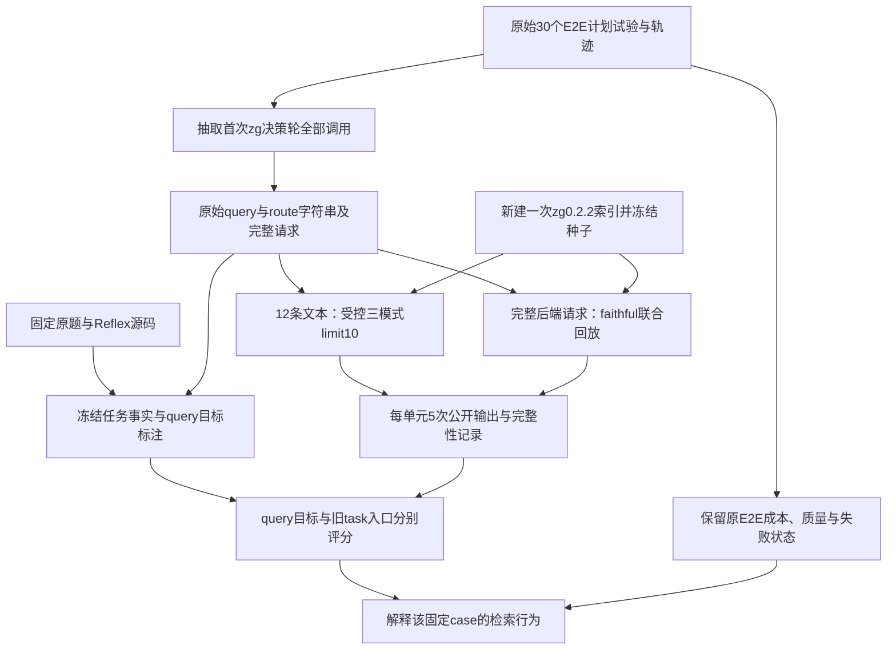

# reflex-6：按真实 query 目标评估的只读检索协议 v4

v4 检查：**zg 对原始问题和 agent 实际发出的检索请求，是否能找到与该次检索目标相关的源码入口。** 它还会重新整理已有 E2E 的调用与证据，但不生成新的 agent 会话、最终答案或模型评分。

这是固定 `reflex-6` 的开发实验。v3 的计划、原始轨迹、自动评分和结果文件保持原样；v4 使用新目录存储抽取、标注、回放和分析结果。协议变更不追溯覆盖 [v3](readonly-qa-v3.zh-CN.md) 的结论。

## 1. 数据来源与样本单位

原始任务和答案材料来自 SWE-QA 的 `reflex-6`，源码固定为 Reflex commit `fe0f946dc0c240c6c1e513318c21db407e191c78`。测试检索实现使用发布包 `@zvec/zvec-grep@0.2.2`，embedding 为 `local/potion-code-16m-v2`。

真实请求取自 CI run `34255587426` 的三组原始 E2E：

| 原组合 | baseline | zg |
|---|---:|---:|
| OpenCode + GLM-5.2 | 5 | 5 |
| OpenCode + Qwen3.8-Max | 5 | 5 |
| QoderCLI + Qwen3.8-Max | 5 | 5 |

**这30个计划试验仍是原来的30个试验。** 零次使用 zg、provider 错误、测量失败和执行不完整都保留。尤其 OpenCode + Qwen 的 zg r02 有最终答案，但原记录包含5次 provider HTTP 500，仍保留 `measurement_failure / execution_incomplete`，不能因离线检索命中或答案内容合理而转为通过。Qoder 中未使用 zg 的试验也不从采用率或 E2E 分母中删除。

抽取单位是每次试验**首次出现 zg 调用的完整模型决策轮**：保留同一轮的所有 zg 调用、原始参数、返回文本与关联后端请求，而不仅保留第一个调用。现有材料共有15个首批 zg 调用，来自14个实际使用 zg 的 treatment 试验。一次调用中的主 query、FTS/vector route 文本可以不同。

调用关联以原生返回文本与 zg 事件的 SHA-256 一致为依据。仅在模型本轮开始前返回的工具反馈，才属于该轮已有反馈；同一条模型消息中并发或先后执行的工具，不能据执行时间推断成“先看结果，再改写query”。

## 2. 12条文本与两种回放

主文本集合是**原题1条＋首批实际请求中11种不同字符串，共12条**。v3 人工编写的 `dependency-discovery`、`selective-refresh` 两条探针不进入v4主文本集合。保留每种文本的调用、试验、组合和参数位置来源；出现频率是同一任务的观察次数，不是独立问题数。

`["derived state computed getter dependency tracking", "state variable recompute dependencies"]` 等数组样式内容，在原后端记录里仍是一个字符串。v4保持括号、标点、空格及单字符串身份，不将它拆成两条虚构检索，也不修复原请求。

| 回放 | 固定的内容 | 要回答的问题 |
|---|---|---|
| 受控文本回放 | 每条文本分别以 FTS、vector、hybrid 执行，`limit=10`，共12×3个单元 | 同一文字、同一源码与输出限制下，各模式如何定位入口 |
| 原请求回放（faithful） | 保留实际后端请求中的 query / queries / routes、fuse、limit及其他已记录字段，缺省仍缺省 | zg 对 agent 当时真正提交的组合请求返回什么 |

原请求按完整请求的规范化JSON去重，仅忽略对象键顺序，保留所有出现位置。当前记录产生12种不同后端请求；以输出的 `replay-plan.json` 为准。每个受控或原请求单元执行5次，因此当前计划是180次受控检索与60次原请求检索，共240次。新增材料或修改请求需生成新的计划和标注版本，不在运行途中挑选成功query。

faithful 的主评分对象是**整个请求的联合返回**。即使联合返回包含多个route的结果，也不能把同一返回分别当成多个独立route试验，或断言某一条route单独导致了命中。按各文本查看联合输出可以保留为附加诊断，但必须注明不能作route归因。



## 3. 任务事实与query目标分别标注

`reflex-6.query-intents.json` 记录固定源码文件、证据片段和定义锚点的哈希。原Benchmark答案是查找线索；有冲突时以固定源码为准。原九段答案证据不被改写成新的检索命中要求。

任务层有三个事实：

1. `ComputedVar.fget` 返回保存的用户getter，getter负责计算派生值。
2. 自动依赖发现分析getter字节码并记录状态变量访问，也可以保留显式静态依赖；不是通过执行整个getter并观察返回值来发现依赖。
3. 反向依赖指导缓存失效及后续重算；非缓存访问直接调用getter，时间过期等也可以触发更新。

这些事实用于说明子目标与原任务的关系，**不要求每条query都召回全部事实或完整九段源码**。

每条query另记录原题关联、检索目的、判断依据和分类：原题、等价改写、合法子目标、歧义或偏离。当前12条标注分别为1条原题、6条等价改写、4条合法子目标及1条歧义。分类是根据原题、请求文字及同轮请求上下文作出的语义判断，不冒充agent明确声明的意图。

可接受入口使用OR：找到其中一个即可定位该子目标。桥接入口单列，表示它能帮助继续追踪，但不自动升级为该query的直接目标。文件、类、函数的身份保留；不会因同文件或父类范围包含目标，就声称已显示目标函数。

例如，GLM r02首批第二条实际query是 `derived state variable computation function getter`。它的公开第4项完整显示 `ComputedVar.fget`，包括 `return self._fget`；第9项显示异步getter。将它解释为getter定位子目标时，这些都是可接受的入口。旧三个依赖主函数在该返回中未出现，因此旧task入口可以未命中，而query目标已经命中。这个例子不证明getter片段足以回答完整原题。

**标注者是本次Codex开发agent，非官方检索gold，也不是独立人工gold。** 标注时已经看过旧实验及上述getter结果；后续冻结只能防止回放中动态改规则，不能使开发集变成held-out测试。未知query、未审查的多文本组合请求、语义歧义或偏离任务的请求保留明确状态，query条件下的质量为 `unknown`，旧task入口观察仍可计算。

未列入目标的返回项标为“未审查”，不自动判不相关。当前清单不穷尽所有合法阅读路径，不能由未命中推出“zg没找到任何有用信息”，也不能把这些正例锚点当成穷尽相关性的recall gold。

## 4. 报告两列入口指标

| 列 | 判定目标 | 解释限制 |
|---|---|---|
| query目标 | 该query冻结的可接受入口OR；桥接入口另列 | 定位该次检索目的，不等于回答原题正确 |
| 旧task依赖入口 | `ComputedVar._deps`、`DependencyTracker._populate_dependencies`、`BaseState._init_var_dependency_dicts` 三者OR | 保留与旧实验可比较的入口诊断，不代表所有有用入口 |

两列分别报告 Hit@1 / @5 / @10、首个命中的原始rank、RR@10和到命中结果块末尾的累计UTF-8字节。计分只读取公开返回，不使用隐藏的完整实体正文补足被截断的信息。正确路径和完整定义行，或目标自身准确范围内的定义outline，才构成可核验锚点。

原生完整输出与前4096 / 8192字节视图分别报告。预算视图从相同原生文本的开头截取，不重排、不先去重，不在截断到半行时补全定义；它不是新E2E实际执行的输出裁剪策略。字节数不换算成模型input tokens。

faithful可能返回15或20项。保留这些原始slot，但Hit@10仍只看前十；首次入口在第15项时，记录rank15、Hit@10=false、RR@10=0，不删除前项来改善排名。旧task指标也遵守相同固定K值。

已识别格式中的无结果，或没有出现已标注目标，是观察到的未命中；无法识别格式、执行失败、身份或完整性校验缺失是unknown。两者不能混成0。即使query目标未知，也不能自动将独立的task入口观察清零。

## 5. 只读执行、索引与重复性

运行前从固定commit取得源码，验证源码片段与入口定义；准备阶段新建一次本地embedding索引，记录构建耗时、包与镜像身份。索引准备不计作QA的模型input或工具调用。本轮不优化跨CI索引复用。

源码以只读方式挂载。每个不同回放单元从本轮种子取得独立工作副本；原始种子不暴露为可写索引。回放通过已发布0.2.2的API及公开formatter，使用原生short输出；不启动daemon，不调用增量索引，`autoUpdate=false`。检索容器禁用网络且不注入模型端点凭据；准备阶段的仓库和本地embedding下载与检索执行分开。

启动时检查索引完整且新鲜：新增、修改、删除、待处理和失败文件计数均为零；检查源码、包、embedding身份及索引manifest。单元结束时再次读取所有文档字段与向量，核对其哈希，并核对源代码和原始种子未变。工作副本的原生存储物理字节可能变化，必须单独保留变化记录，不能未经调查就认定只是无害元数据，也不能把物理变化直接等同于新增文档或向量变化。

**同一单元的5次调用串行复用同一引擎进程和工作副本。** 首次查询可能包含该进程首次搜索的加载工作，后四次可能受缓存或引擎状态延续影响；启动校验已读过索引，操作系统缓存及模型文件缓存也可能被其他单元预热，因此“第1次”不等于严格机器冷启动。报告应保留各次耗时、公开文本哈希及次序，并区分首条与后续调用。

这5次用于观察固定请求在这一执行条件下的检索重复性，**不是5个独立agent样本，也不增加QA任务数**。每单元预先取第1次作为质量观察，其余重复不替换缺失或较差的第1次。组内文本相同不推出跨单元、跨索引或跨运行完全相同；发现差异先保留实际文本与索引记录，未验证时不猜测根因。

## 6. 产物与结论范围

v4应在新目录保留：

- `first-query-analysis.json`：首批完整调用、准确query、请求来源、原生/后端关联及前置反馈边界。
- `replay-plan.json`、`provenance.json`：全部预定单元和重复槽位，原语料、case、标注与计划哈希。
- `observed-query-scores.json`：对旧公开返回新增的query目标诊断，保留原执行状态。
- `runtime-manifest.json`、准备日志、snapshot：新建索引的身份与准备成本。
- 每单元的请求、stdout、stderr、zg事件、退出状态和完整性记录，以及 `replay-report.json`、最终源码/种子校验。

产物中的 `new_model_calls=0` 指新增生成式 LLM/API 调用为零；索引构建与检索仍会运行本地 embedding 模型。

v4没有新的E2E成本或答案样本。旧30个试验的成本和质量仍按原组合分别分析，保留已有自动judge结论、源码复核分歧及失败。不能用本次检索命中反向证明旧答案正确、旧成本下降具有因果关系，或agent在重新运行时会稳定产生相同改写。

这轮能回答“哪些真实文字或组合请求能定位哪些已标注目标、目标出现在多靠前的位置、公开输出有多长、重复时怎样变化”。要声称更广泛的zg收益，仍需在未参与本次标注的新任务上，重新验证任务选择、答案质量和完整E2E成本。

## 7. 如何复算

从原 run `34255587426` 下载三个完整 artifact，分别解压到同一目录下的 `opencode-glm52/`、`opencode-qwen38max/`、`qoder-qwen38max/`；每个目录直接包含其 `manifest.json` 和十个计划 trial。使用 Python 3.12 的锁定环境，从仓库根目录执行：

```sh
uv sync --project benchmarks/swe-qa-bench --frozen
uv run --project benchmarks/swe-qa-bench python -m zg_bench.swe_qa.retrieval_replay analyze \
  --recorded-runs /absolute/path/to/recorded-qa \
  --case benchmarks/swe-qa-bench/cases/reflex-6.json \
  --entries benchmarks/swe-qa-bench/cases/reflex-6.entries.json \
  --labels benchmarks/swe-qa-bench/cases/reflex-6.query-intents.json \
  --output benchmarks/swe-qa-bench/runs/v4-new-analysis
```

`analyze` 只读取原有轨迹并输出计划和旧返回的新指标，不构建索引、不调用 LLM。输出目录必须新建，不允许覆盖已有结果。运行真实检索时，先按 `.github/workflows/readonly-qa-v4.yml` 构建固定 Docker 镜像，将上面子命令改为 `run`，另指定新的输出目录及 `--image zg-readonly-qa:0.2.2`。该路径会新建索引并执行固定240次检索，不需要生成模型凭据。

该分支的新回放 workflow 可由 push 触发。回放实现提交使用 `[retrieval-only]` 标记，使旧 `readonly-qa.yml` 的 E2E 作业跳过；只整理文档和格式的提交使用 `[skip ci]`，避免重复执行。已有成功回放及原有E2E归档不被替换。
