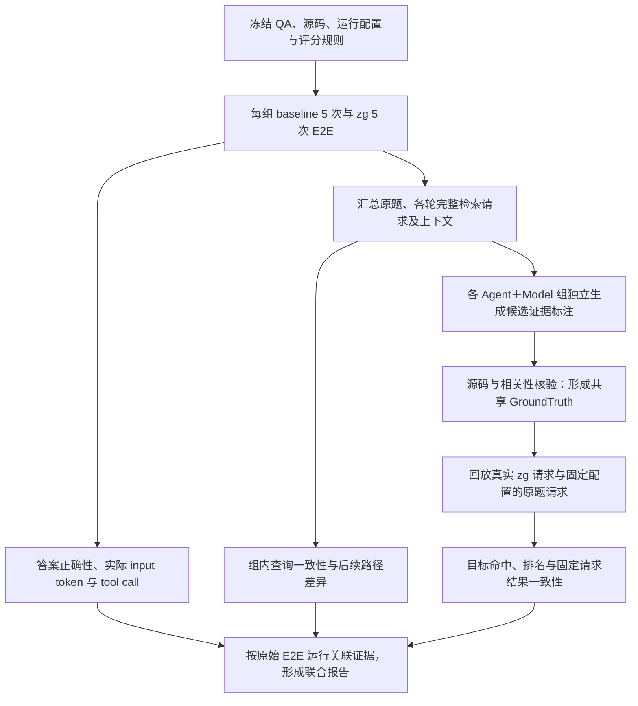

# reflex-6：E2E 驱动的检索诊断流程 v6

**状态：实现已接入，首次 CI 实测待验证。** [主 workflow](../../.github/workflows/readonly-qa.yml) 串联本轮 E2E、全轮查询、共享标注、检索回放与联合报告。[v5 实现](readonly-qa-v5.zh-CN.md) 保留为手动历史回放入口，不再在 push 时与主流程同时运行。代码检查和旧轨迹的离线解析不算本协议的新实测结果。

目标是在固定只读 QA 上，先测量答案质量与实际成本，再用本轮真实查询解释结果。retrieval-only 是同一轮 Benchmark 的诊断阶段。独立检索回归集、独立版本比较和三模式全量对照后续规划，不作为本轮交付要求。

## 1. 先执行 E2E

- 固定 SWE-QA `reflex-6`、Reflex commit `fe0f946dc0c240c6c1e513318c21db407e191c78`，使用发布包 `@zvec/zvec-grep@0.2.2`。
- 测试组为 OpenCode＋GLM-5.2、OpenCode＋Qwen3.8-Max、QoderCLI＋Qwen3.8-Max。每组 baseline 与 zg 各 5 次，共 30 个计划运行；每次独立会话。组内固定 Agent 版本、模型端点与版本信息、提示词、工具契约、预算和可支持的采样参数，并保存实际生效配置；无法确认的参数标为未知。
- 每轮 CI 新建索引，不依赖跨 CI 的旧索引。保留本轮索引快照供诊断回放；源码只读、关闭增量更新，记录源码与索引身份并核验内容完整性。索引准备发生在 E2E 之前，但不提前进行用于选择查询或调整答案的检索试跑。
- 预先固定 baseline／zg 的执行顺序安排，交错运行以减少时间漂移影响。5 次是小样本重复试验，保留每次结果和范围，不将其包装成总体收益保证。
- 所有失败、超时、未调用 zg 和计费数据缺失的运行都保留。缺失不计为零；不能只挑成功运行比较成本。错误恢复尝试单独记录，不替换原定样本。
- 最终答案依照同一份原题评分规则评估，评分时隐藏测试组与成本。记录原生实际 input token、tool call 和答案判定；标注、诊断回放与索引准备成本单列。

## 2. 从本轮轨迹收集原题和子查询

收集所有轮次的实际检索行为，不要求 Agent 在会话结束后重新回忆或改写查询。每条记录保留运行 ID、Agent／Model、baseline／zg、工具名称、模型决策轮、工具调用 ID、完整原始参数、调用前可见上下文、返回内容和执行状态。

- 原始问题按 case 原文收录一次。
- zg 请求完整保留 `query`／`queries`／`routes`、模式、融合参数、过滤条件、limit 以及字段缺省状态。文本用于观察改写；完整请求是主回放单位。多路联合请求不拆成若干独立查询后冒充真实调用效果。
- baseline 的 rg、文件查找与阅读轨迹用于比较探索路径。正则、文件名或 shell 命令不直接转换为 zg 的自然语言查询，以免引入本轮 Agent 没有发出的请求。
- 去重只减少重复回放，不删除出现次数、来源和上下文。相同请求在不同上下文下可以有不同查询意图；回放结果可共享，相关性判断须保留上下文区别。
- 首次 zg 决策批次用于主要一致性分析，保留同轮全部调用。后续查询按轮次与此前反馈关联分析。首次 zg 之前若已执行其他工具，明确标注；不能将不同已知信息下的查询差异全部归因于随机性。
- 非法请求、无 zg 调用和关联不明的记录单列。无法忠实回放的请求不自动修复后计入正常成绩。

本轮完整查询目录冻结后再开始标注。后续轮次采集替代 v5 的“仅采集首次 zg 决策轮”限制；首轮仍是行为一致性的主要观察位置。

## 3. 各组产生候选 GroundTruth，核验后共享

各 Agent＋Model 测试组在独立标注会话中，对同一份查询目录提供候选结果。输入包括原题、待标注的实际请求、理解该请求所需的此前上下文，以及固定版本的完整源码。标注不限制在该组 zg 返回的文件中，也不直接将原题参考答案或 E2E 最终答案作为子查询的标准结果。

每份候选标注至少包含：

1. 查询意图及其与原题的关系：原题、等价改写、合法子目标、歧义或偏离。
2. 可接受的源码入口与证据：仓库 commit、文件路径、符号、行范围、原文及内容哈希；说明该处为何回答此查询。
3. 可替代入口的关系，以及仅能引导继续查找的桥接入口。完整原题和 getter 等局部子目标分别建立标准。
4. 标注组、模型配置、输入和输出来源，以及不能确定的内容。

随后核验源码锚点是否存在、引用内容是否一致，并审查语义相关性及子目标与原题的关联。**源码存在性校验不能代替相关性审查；生成组一致同意也不自动构成事实证明。** 各组候选汇总成共享标注；相同请求及相同上下文使用同一评价标准。尚未解决的分歧保留 `unknown` 和分歧理由，不强行按多数投票定真，也不记为检索失败。

首次回放前冻结共享标注及其哈希，保存各组原始候选。后续发现遗漏时显式修订标注版本并统一重评分，不能只改动某组标准。独立标注会话仍属于模型辅助开发标注，不宣称是独立人工 Gold；输入上下文若已经含有检索返回，也记录这一限制。

多路联合请求需要单独确认其目标集合，联合结果的命中不归功于其中某一条 query。只有部分已审查正例时，指标解释为“已标注目标命中”，不声称覆盖了所有相关结果。

## 4. 执行 retrieval-only 诊断

回放使用本轮冻结源码和索引快照、相同 zg 版本与检索配置，先核验 E2E 期间的索引内容未发生变化。完整性无法确认时将其记为解释限制，不能声称复现了同一环境。

分别报告两类请求：

- **真实请求回放：** 所有可忠实执行的 zg 完整请求，保留真实参数和所有来源。正常回放不重新调用模型生成 query。
- **原题参考请求：** 原题全文按预先规定的 hybrid、`limit=10` 配置执行。它提供共同参照，不代表某组 Agent 实际使用过该请求，也不混入真实请求成绩。

每个唯一请求执行 5 次。预先固定第 1 次用于质量观察，其余用于结果一致性检查，不挑最好的一次；这 5 次不是新增 E2E 试验。请求参数同时发生变化时，原题与改写结果差异不能仅归因于措辞。

指标沿用 `entry-ranking-v1`：

| 观察项                         | 回答的问题                                                                   |
| ------------------------------ | ---------------------------------------------------------------------------- |
| 已标注目标 Hit@1／5／10        | 可接受入口是否在前 K 项中出现？                                              |
| 首次目标排名、RR@10            | 第一个可接受入口排在哪里？RR@10 为前 10 项内首次目标排名的倒数，未命中为 0。 |
| 5 次目标排名与原生输出的一致性 | 固定请求、固定环境下，检索结果是否发生变化？                                 |
| 错误、unknown 与可评分请求数   | 有多少请求有足够证据进入指标，哪些仍无法判断？                               |

保留原生排名与匹配源码证据；桥接入口单列。没有可接受标注的查询不计零分。查询更多的 E2E 运行不能因此得到更多“独立 QA 样本”。请求级结果、按出现次数映射回各次 E2E 的结果和原题参照分别展示。

不计算 4／8 KiB 窗口命中、总输出字节数或到首个命中块末尾的累计字节。原始返回仍作为审计证据保存，不能用输出字节替代实际模型 input token。

## 5. 联合解释 E2E

### 查询行为是否一致

**每个 Agent＋Model 组内**分别报告首次查询文本、完整参数和首批请求的不同版本数，以及最常见版本的次数／可观测运行数。例如某一首批请求出现 4／5，表示本次 5 个可观测运行中有 4 次选择相同请求；同时报告未调用 zg、失败和缺日志的数量。跨组差异另列，不把不同模型的不同策略视为组内随机性。

一致性由 E2E 轨迹直接计算；retrieval-only 用于补充“这些不同查询的检索效果是否也不同”。完全相同的查询文字并不保证参数、后续行为或最终结果一致；不同文字也可能命中同一入口，因此同时展示检索目标与最终成本分布，不新建未经验证的综合稳定性分数。

### 检索表现是否解释了成本差异

每次 E2E 关联以下可核验记录：

> 实际查询与上下文 → 当时实际返回的目标位置 → 后续是否阅读或明确引用该证据 → 后续检索与工具调用 → 实际 input token → 最终答案判定。

新回放结果与当时实际返回分别保存。若不一致，先调查环境、索引或执行差异，不能用新回放结果替代 Agent 当时看到的内容。后续读取或引用是可观测行为，不能直接证明模型内部使用了证据；无法从日志确认则写明未知。

据此可区分“查询不同但均能定位目标”“请求相同但检索返回变化”“入口很早出现但后续仍多次探索”“入口未出现并伴随反复检索”等现象。检索排名靠前且后续探索较少，是解释成本差异的证据线索；仅凭回放不能断言好 query 导致 token 下降，因果验证需另外设计受控干预。

最终仍以各组 baseline／zg 的答案质量、实际 input token 和 tool call 判断 zg 收益，逐次展示失败与波动。检索解释不能推翻 E2E 的答案失败，也不能将本 case 的观察推广为全部 QA 的稳定收益。

## 6. 已接入的执行链路与验收条件

CI 的三个阶段为 `prepare → evidence（三组）→ diagnosis`。源码、索引与 Docker 镜像在 prepare 阶段冻结并作为同轮 artifact 传递；之后不重新构建索引或镜像。每个消费方校验 run ID、提交、case、包版本、镜像和内容身份。跨 CI 的旧索引不能作为本轮输入。

1. `readonly_run --controlled --e2e-only --prepared-dir ...` 运行每组 5 对 E2E，跳过前置检索探针和旧字节窗口报告。三个矩阵任务分别保存计划中的全部 10 个运行。
2. `pipeline_artifacts assemble` 只接收本轮三组产物；拒绝旧 run、不同提交、缺组和重复组尝试，不静默选择其中较好的结果。
3. `query_trajectory` 从原生轨迹和可验证后端事件采集全轮请求，输出 `query-analysis.json`。完整请求去重用于执行，request＋可观察上下文用于标注，两种身份分开。
4. `query_ground_truth` 用每组的新只读无 zg 会话提出候选，并由另外两组分别审查。Python 源码定义、片段、哈希由程序提取；每个候选需要源码校验和两份有源码依据的相关性认可。不同有效候选可共存，分歧候选保留 unknown。标注会话及原生成本独立保存。
5. `pipeline_runtime replay` 校验同轮环境、查询目录及冻结标注后执行 5 次回放。按上下文分别评分；同一实际请求的多个出现位置不重复计独立 QA。
6. `joint_report` 重新核对 E2E 来源，关联实际返回与新回放、后续行动、质量和成本。若前一阶段失败或标注不足，报告明确呈现 partial／unknown，不改写为成功或零分。

产物由 GitHub Actions 保存：

| Artifact                                     | 内容                                                                                                        |
| -------------------------------------------- | ----------------------------------------------------------------------------------------------------------- |
| `readonly-qa-v6-prepared-<run>-<attempt>`    | 本轮源码、索引、embedding 文件、snapshot、准备 manifest 和精确 Docker 镜像；用于复现该轮条件。              |
| `readonly-qa-v6-e2e-<group>-<run>-<attempt>` | 每组 10 个计划运行、原生轨迹、工具日志、实际用量、完整性记录与最终答案评审。                                |
| `readonly-qa-v6-diagnosis-<run>-<attempt>`   | 全轮查询目录；各组标注和审查原文；源码核验、分歧与共享标签；每请求 5 次原生返回；联合 JSON／Markdown 报告。 |

主报告为诊断 artifact 中的 `joint-report.md` 和 `joint-report.json`。运行器、请求关联、标签核验和完整性检查通过，说明链路可执行；是否观察到 zg 收益，仍须依据该 run 的最终质量与实际成本单独判断。独立检索回归和三模式实验后续规划。
