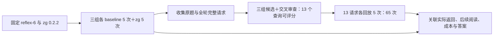

# reflex-6 v6：自定义只读桥接链路实测与诊断

**评测身份更正：本轮未执行 `zg install`，不能作为原生安装集成收益的验证。** Benchmark 自行配置 `readonly-search.mjs`，虽复用发布包的 MCP schema、工具说明和检索 API，但没有加载安装器写入的 Agent guidance，并绕过原生 daemon、强制 `autoUpdate=false`。安装 guidance 包含检索路由、避免宽泛读取及如何使用返回片段等策略，会影响采用率、token 与 tool call；因此“检索引擎和工具 schema 来自发布包”不足以证明集成等价。以下原始数据和诊断只适用于这套自定义桥接实验。此前将其交付为用户所需的完整 zg 集成评测，是评测设计与范围声明错误。

**完整链路已执行：30 次 E2E、13 个查询上下文标注、65 次检索回放及联合审计。** 本 case 中，OpenCode＋GLM 的平均 input token 下降 16.97%，Qoder＋Qwen 下降 29.94%，OpenCode＋Qwen 则上升 18.43%；三组平均 tool call 均下降。全部答案源码审计发现双评审漏检的机制错误，因此这些成本变化不能直接表述为“质量不下降的稳定收益”。

## 1. 固定任务、选择依据与执行身份

任务为 SWE-QA `reflex-6`，原题保持不变：

> What is the role of the computation function returned by the derived state variable class's computation function accessor in the framework's dependency tracking for state recomputation?

题目没有直接提供 `ComputedVar`／`fget`。选题时仅查看预先冻结候选池的 baseline：三次运行在首次源码读取前分别进行了 4／6／5 次 grep，呈现可重复的入口探索。选择发生在本轮 zg 结果产生之前，并非挑选 zg 得分最高的题；筛选范围与局限见 [SELECTION.md](../../benchmarks/swe-qa-bench/cases/SELECTION.md)。历史筛选成本未用于本轮对照。

| 项目          | 本轮固定值                                                                                             |
| ------------- | ------------------------------------------------------------------------------------------------------ |
| 待检索源码    | Reflex `fe0f946dc0c240c6c1e513318c21db407e191c78`                                                      |
| zg／embedding | 发布包 `@zvec/zvec-grep@0.2.2`；`local/potion-code-16m-v2`                                             |
| Agent／Model  | OpenCode **1.18.4**＋GLM-5.2；OpenCode **1.18.4**＋Qwen3.8-Max；QoderCLI **1.1.45**＋Qwen3.8-Max       |
| 试验规模      | 每组 baseline 5 次、zg 5 次，独立会话、预定交错顺序；共 30 次，但只有 **1 道独立 QA**                  |
| 任务与环境    | 只读 QA；本轮准备索引，源码不修改，关闭增量更新；索引准备、标注和回放成本不计入 E2E                    |
| 预算          | 每次累计 input 300000、模型请求 30、工具调用 60、时间 900 秒；原生计量达到阈值后停止，允许在途执行超限 |

模型名称为实际配置与原生日志可观察的别名；未证明别名背后的服务端权重快照固定。

- **E2E 原始证据**：[CI 34831000387](https://github.com/Cuiyus/zvec-grep/actions/runs/34831000387)，attempt 1，评测代码 commit `0fd55b4125c32995ac243f913f5f1ddc7ec9fc3c`。
- **首次诊断恢复，已取消**：[CI 34833758208](https://github.com/Cuiyus/zvec-grep/actions/runs/34833758208)，分析代码 commit `e798fcf3ba8277a55ad0cb14a9330ced824b838e`。发现连续标注失败后主动取消，完整工件与失败原因已保存。
- **诊断恢复，已完成**：[CI 34836195367](https://github.com/Cuiyus/zvec-grep/actions/runs/34836195367)，修复 commit `84db28a4c47419bb6bee9b451b9f30333c3dca64`。完成同一批 **13 个请求与上下文标注单元**，**不重跑原 30 次 E2E，也不重新评判原答案**；两个恢复 run 都不是新增 E2E 样本。

流程定义见 [v6 协议](../benchmark-protocols/readonly-qa-v6.zh-CN.md)。[E2E 证据摘要](readonly-qa-v6-reflex-6.e2e.json) 保存三组来源哈希、30 次核心指标与质量状态、全部 15 对成本、统计及查询一致性；原生工具日志留在原 CI 工件中。

## 2. 所有计划运行的质量与成本

**三组各 arm 的 5 份答案内容均获双评审 raw pass，但这不等于源码核验全部正确。** 评审为 GLM-5.2 与 Qwen3.8-Max；后续源码审计发现漏检，原始分数保留，反证单列。Qoder baseline 中两次超出输入预算，所以协议判定为 `execution_incomplete`：预算内完成为 **3/5**，其 zg arm 为 **5/5**；另外两组双方均为 5/5。

下表保留每个 arm 全部 5 次，包括超预算和未调用 zg 的运行，不按成功状态筛选。input 与 calls 的每格依次为 **均值／中位数／最小–最大**。

| 组合／arm               |                     input token |       tool call |
| ----------------------- | ------------------------------: | --------------: |
| OpenCode＋GLM baseline  |  116645.6／118653／83185–153250 | 14.4／13／11–18 |
| OpenCode＋GLM zg        |    96849.2／91953／74744–131879 |   10.2／9／8–15 |
| OpenCode＋Qwen baseline |  114550.6／106013／70475–176685 | 14.4／14／12–19 |
| OpenCode＋Qwen zg       |  135663.8／119809／69615–203699 |  12.6／12／9–17 |
| Qoder＋Qwen baseline    | 239802.8／252463／154382–321688 | 17.8／18／14–21 |
| Qoder＋Qwen zg          | 168002.4／167341／146332–189027 | 13.6／13／11–16 |

| 组合           | zg 平均 input 相对 baseline | zg 平均 calls 相对 baseline | 5 对 input 下降／上升 | 5 对 calls 下降／上升 |
| -------------- | --------------------------: | --------------------------: | --------------------: | --------------------: |
| OpenCode＋GLM  |                     −16.97% |                     −29.17% |                  3／2 |                  4／1 |
| OpenCode＋Qwen |                 **+18.43%** |                     −12.50% |                  2／3 |                  4／1 |
| Qoder＋Qwen    |                     −29.94% |                     −23.60% |                  3／2 |                  5／0 |

百分比为 `(zg 均值 / baseline 均值 − 1) × 100%`；正值表示 zg 成本更高。配对仅依据预定的时间区块，并非共享随机种子。全部逐次数据和每对方向见证据 JSON 的 `trials`／`pairs`。

原生审计对 30 次运行逐消息去重，核验 input／output／cache 与结果、报告一致，工具调用按原生 call ID 去重后计数一致；60 份 judge 输入答案均与对应原生最终答案完全相同。OpenCode 的 input 口径为 `native input + cache.read`，Qoder 为原生已含 cache-read 的 input；不重复加缓存，也不将 token 换算为费用。工具粒度、提示词和服务端模型身份未证明跨 Agent 等价，主要结论来自**同组 baseline／zg 比较**。

### 答案源码审计揭示的评审漏检

对全部 30 份答案追加事后源码审计，发现以下问题。它是 Codex 的源码核验，既不是人工 Gold，也没有生成新的通过率或替换原始模型评分。[逐答案审计 JSON](readonly-qa-v6-reflex-6.answer-audit.json) 保存原文短引、源码片段、文件哈希、原评分与 required-fact 表述覆盖。

- **明确的核心机制矛盾：GLM zg r01。** 答案称依赖注册遍历并计算 “every `ComputedVar`”，但 [固定源码](https://github.com/reflex-dev/reflex/blob/fe0f946dc0c240c6c1e513318c21db407e191c78/reflex/state.py#L779-L783) 在调用 `_deps` 前跳过 `cache=False`。这个反证当时已提供给两个 judge，仍获全维度通过；一个 judge 的理由还补出了候选并未说明的 uncached 行为。
- **10 份答案对异常分支作了不准确的概括。** OpenCode＋Qwen baseline r01、zg r03，以及 Qoder baseline r01／r02／r04、zg 全 5 次，将扫描异常后的返回概括为静态依赖。实际 tracker 原地修改传入字典，异常处理没有回滚；异常前已加入的自动依赖可以保留。这是非核心附加细节，原 judge 引文未包含完整异常实现，与上一项明确给出反证仍漏判分开记录。
- **缺漏、范围过宽和歧义单列。** 例如 GLM zg r01 未解释删除缓存及下一次访问调用 getter；GLM zg r03 的 “full call graph” 概括过宽，但上下文已正确描述字节码扫描，不能视为把静态扫描说成执行 getter。

审计逐一确认 30 份原生最终答案、60 份 judge 候选输入相同，rubric 的 15 段源码片段与固定源码字节和哈希一致。因此问题不来自答案提取错位或源码版本错配。**本轮成本变化已经测到，但当前 raw pass 不足以证明“答案质量不下降”。**

## 3. Qoder 两次预算失败意味着什么

| baseline 运行 | 最后回答前 input | 最后回答轮 input | 最终 input／预算 | 协议状态         |
| ------------- | ---------------: | ---------------: | ---------------: | ---------------- |
| r03           |           289013 |            32675 |   321688／300000 | budget_exhausted |
| r05           |           275559 |            34566 |   310125／300000 | budget_exhausted |

两次都记录了完整答案和原生 `result: success`，答案内容双评审 raw pass；超限在最终回答轮 usage 到达后被检测到。它们分别只用了 16／14 个模型轮、20／18 个工具、约 151.9／112.5 秒，因此不是时间或工具次数上限触发。**不能描述为没有答案，也不能因答案存在而改成预算内通过。**

两次 baseline 均在核心源码之外继续验证 getter、mixin、异步路径及 dirty 状态等细节，较大的上下文在多轮中累计，最后回答推高总量。这提供成本形成的可观察线索，不证明这些额外步骤一定无用。

## 4. 查询稳定性应看完整请求与首批次

下表的“一致性”是最常见版本次数／可观察的采用运行数；未采用仍保留在原定 5 次 E2E 中。首批指同一个模型消息里的所有 zg 调用，完整原始参数保留字段缺省和字面字符串。

| 组合           | 实际采用 zg | 首个完整参数：种数；最常见 | 首批 zg 请求：种数；最常见 | 全轮 zg 调用 |
| -------------- | ----------: | -------------------------- | -------------------------- | -----------: |
| OpenCode＋GLM  |         5/5 | 2；4/5                     | 3；3/5                     |            7 |
| OpenCode＋Qwen |         4/5 | 4；1/4                     | 4；1/4                     |            4 |
| Qoder＋Qwen    |         4/5 | 4；1/4                     | 4；1/4                     |            4 |

两个 OpenCode 组各自 5 次初始 wire body 完全相同且哈希核验通过，实际发送 `temperature=0`；GLM 省略 `top_p`，Qwen 为 1。仍然出现不同的首批动作与后续路径。Qoder 没有 wire body，温度和初始完整请求一致性均未核验。

OpenCode＋Qwen 的主 `query` 在 3/4 个采用运行中相同，但每次还附带不同的 `fts` 数组形字符串，因此完整请求没有重复。Qoder 的 `query` 主字段仅有 3 次，另一次通过 `queries` 传入数组形字符串；这些字符串在真实后端保持单个查询，不擅自拆词修复。请求参数不同，返回不同不能证明固定请求不稳定。

两个 Qwen 组的 **r01 zg arm 均未调用 zg**，都已保留在主统计中：OpenCode r01 直接使用 `ComputedVar`／`fget` 精确 grep；Qoder r01 先猜测 MobX 路径，遇到不存在路径后通过普通 grep/read 纠正。它们的成本改善不能直接归因于 zg 检索。精确符号搜索也不构成模型训练泄漏的证据。

## 5. 联合解释成本和质量差异

- **GLM：首查询和返回固定，后续成本仍变化。** r01／r02／r04／r05 的首个完整请求与可见返回 SHA-256 均相同，但最终 input 为 95490／74744／90180／131879，calls 为 10／8／9／15。r02 在首个模型消息中发出两个 zg 调用，不能称为看到首次结果后改写；r05 的第二 zg 才发生在下一模型轮。
- **OpenCode＋Qwen r02：调用更少，但上下文更大。** zg 为 173046 input、14 calls，baseline 为 127484、15 calls。首次检索后，它请求 `base.py` 起 480 行及未设 limit 的依赖追踪文件读取，第三模型轮 input 已达 20312，后续又验证 app、state、getter 包装和 `_copy_fn`，最后一轮 input 为 29428。
- **OpenCode＋Qwen r05：后续阅读路径扩展。** zg 为 203699 input、17 calls（13 次 read），baseline 为 70475、12 calls（7 次 read）。zg 运行继续验证 dirty propagation、setter、更新与 getter 调用路径，执行 10 个模型轮，最后一轮 input 达 30409。它仅调用了一次 zg，不能把增加归咎于反复 zg 查询。
- **初始请求本身有成本。** 三组 zg arm 的首轮原生 input 比各自 baseline 分别多 2239／2359／2369。这是包含提示词与工具契约等差异的完整请求开销，不能只归因于工具 schema；减少工具次数不保证减少累计 input。

结合已冻结标签与原生返回，以上现象可以进一步解释：

- GLM 四次相同首请求都在整体输出第 9 项包含共同入口 `_deps`，随后仍选择不同阅读与验证路径。**同请求、同返回不能保证相同 E2E 成本。**
- OpenCode＋Qwen r02／r05 的 `_deps` 分别在整体第 17／15 项，但在检索后的下一轮工具读取中已经出现定义；后续仍继续扩读。较晚排名与高成本同时出现，不能据此声称前者导致后者。这些多路请求采用分组输出，单组中 `_deps` 均为 Q1 第 9 项；这里的 17／15 是完整公开输出的全局顺序，不能冒充单路语义候选排名。
- GLM r05 第二轮查询是 getter／cached wrapper 子目标，没有命中已标注主入口，仅有桥接入口；它仍保留在主检索表中，不因最终答案 raw pass 而改成命中。
- GLM r01 的后续 `state.py` 阅读明确包含 `cache=False → continue` 反证，最终却写成 every ComputedVar。**这处问题不能解释为没有检索到或没有读到反证**；日志仍不能证明模型注意或正确使用了它。

这些是“实际请求／返回 → 后续可见阅读 → 成本与答案”的观察链，不是对 query 的受控因果实验。

## 6. Retrieval-only 的实际结果

**12 个真实完整请求＋原题固定 hybrid 请求，各回放 5 次，共 65／65 次成功。** 13 个请求各自的 5 次原生输出完全一致，15 次实际 E2E zg 返回也逐一等于对应回放；两次未调用 zg 的运行作为 no-call 保留，不冒充检索调用。

GroundTruth 的 178 个候选均通过源码定位校验，161 个提名获得另外两组认可，17 个保留 unknown；排除查询内入口角色冲突后，140 个已确认提名用于冻结标签。Qoder 最后一批 review 因提供方等待响应头 60 秒超时失败，影响的 10 个 OpenCode 提名全部保持 unknown；对应查询仍有 3 个由 Qoder 提名、两组 OpenCode 确认的入口。因此 **13／13 查询可评分**不代表全部标注会话成功。

按各查询自己的部分正例入口集，12 个真实请求的 Hit@1／5／10 分别为 **1／12、3／12、8／12**，RR@10 均值为 **0.1824**。三个请求首命中在第 15／15／17 项，一个子目标未见已标注入口。它们不是穷尽 Recall；分母是同一道 QA 的请求数，不是 12 道题。

| 请求 ID 前缀 | 实际来源                           | 各自标注目标的首排名 | RR@10 | 共同 `_deps` 排名 |
| ------------ | ---------------------------------- | -------------------: | ----: | ----------------: |
| 1675dd49     | Qoder＋Qwen r03                    |                    9 | 0.111 |                 9 |
| 38552903     | GLM r02                            |                   10 | 0.100 |                10 |
| 42239c27     | OC＋Qwen r02                       |                   17 | 0.000 |                17 |
| 50a9cada     | OC＋Qwen r05                       |                   15 | 0.000 |                15 |
| 699beb3a     | OC＋Qwen r04                       |                   15 | 0.000 |                16 |
| 7e21d2c7     | GLM r05 第2轮                      |               未命中 | 0.000 |        子目标另评 |
| 852cd814     | Qoder＋Qwen r05                    |                    5 | 0.200 |                 9 |
| 8e91ddbe     | Qoder＋Qwen r02                    |                    9 | 0.111 |                 9 |
| 97f92894     | GLM r03                            |                    1 | 1.000 |                10 |
| 998314f2     | Qoder＋Qwen r04                    |                    6 | 0.167 |                 6 |
| d51e59c1     | GLM r01、GLM r02、GLM r04、GLM r05 |                    3 | 0.333 |                 9 |
| f8a6a034     | OC＋Qwen r03                       |                    6 | 0.167 |                16 |

GLM r02 的两条查询处于同一首批，不能把第二条说成反馈后的改写。原题参照单列：固定 hybrid、limit=10，首个已标注入口和共同 `_deps` 均在第 **6** 项，RR@10 为 **1/6**；它不是 Agent 实际使用过的请求。

### 为什么增加共同入口对照

原题及 11 个等价改写有 **8 套不同的部分正例集合**。例如 `d51e59c1` 和 `8e91ddbe` 查询文字与上下文相同，前十项的地址、顺序和正文相同，却因前者接受第 3 项 `DependencyTracker`、后者的首个已接受入口是第 9 项 `_deps`，产生 3／9 的主排名差异。这个差异来自标签集合，不能解释为 query 或参数带来的检索改善。

新增补充对照自动取同上下文原题与所有等价改写的**已审查正例交集**，本轮仅有 `ComputedVar._deps`；不根据排名挑入口，不给子目标套原题标准。由此两条请求均为第 9 名。真实改写请求对这一共同入口的排名为 **6–17**，原题为 **6**，本轮没有显示改写让这个入口更早出现；参数及多路输出也有变化，不能只归因于文字改写，更不能推断原题请求一定更省 E2E token。

主评分仍回答每条请求自己的入口定位情况；共同入口仅用于控制本轮标签覆盖差异，并不覆盖所有有用证据。完整参数、来源、目标、逐次哈希和两种分数见 [检索证据 JSON](readonly-qa-v6-reflex-6.retrieval.json)；[冻结标签](readonly-qa-v6-reflex-6.query-ground-truth.json) 是本次结果快照，不启动独立检索回归集。

## 7. 执行恢复、费用与可复现证据

原 run 的诊断因模型缓存完整性检查被阻断：当时把整个缓存目录一致性当成权重一致性，已知 completion marker 变化导致误拒。该发布版本的 marker 缓存文件 stat 信息；权重 `model.safetensors` 与两项 tokenizer 工件前后 SHA-256 相同。[完整性修复](../../benchmarks/swe-qa-bench/zg_bench/swe_qa/embedding_integrity.py)仅识别这一个明确 marker，并继续要求真实模型工件和其他文件一致；不宣称整个缓存目录没变，原始失败记录也未改写。

首次恢复还暴露三处标注交付／解析问题：Qoder 无法读取工作区外的 `/annotation`，两批均未产生有效候选；GLM 一批完整 JSON 前有说明文字，被严格解析器拒绝；模块全名形式的源码符号被 AST 定位器误拒。该 run 已取消检查；[保留工件](https://github.com/Cuiyus/zvec-grep/actions/runs/34833758208/artifacts/10343564476) SHA-256 为 `193ad4266d1e5091848f31ec060bb73f8cb8e4c088b4591db1f923399f960f8d`，失败审计身份与原因收录于证据 JSON 的 `diagnostic_history`。

本次恢复复用四批 OpenCode 的原始候选文本：修正解析与符号定位后，**113/113 项候选源码锚点校验通过，没有新增 OpenCode candidate 模型调用**。随后两批 Qoder 候选完成；候选齐备后，12 批语义 reviews 按三组并行、组内顺序执行，11 批完成，1 批因提供方响应头等待超时失败。恢复保留旧状态、原始文本哈希及历史成本，不挑选最佳候选替换失败记录。

被取消的旧 review 用量未知，本次 Qoder 失败 review 也有一轮 input 缺失。当前标注阶段记录 106 次模型请求、172 次工具调用；完整用量会话的 input 合计 3703027，加失败会话已知片段 32644，**可确认下界为 3735671**。历史候选与旧恢复会话可确认 803088，另有中断用量未知。四批复用候选不重复计新增成本；这些都不计入 E2E，不换算为货币费用，也不宣称完整账单已知。

本次原始诊断 [工件](https://github.com/Cuiyus/zvec-grep/actions/runs/34836195367/artifacts/10345801290) SHA-256：`d9e11b67d38b89388b1767671153c41dcee1a94df9737597b0509a9f570f02ce`。查询标签 SHA-256：`c3f3f7815e59aa47dbe52fed7a9ed3a6633ea378395842bac1aa18cc20d8cae0`。原始失败、候选、reviews、输出和分数均未改写。

源码、标签、输出、native usage 的独立复核通过；其中 486 个源码文件和 65 个输出在本地重新计算哈希，15 次原生 E2E 返回逐字比对。镜像、完整索引与 embedding 本体位于原 prepared 工件，本地对它们核验的是 CI 原生身份和完整性记录，不冒充重新读取了模型权重。

旧运行的 `runtime-manifest.cross_ci_index_reuse=false` 将“同一 E2E 批次”与“同一个 CI 执行”混淆：本次确实跨 CI 恢复了同一批次的精确索引。源／分析 run ID 和快照哈希仍正确；该原字段保留，并在结果 JSON 标出。后续代码已分别记录跨 CI 恢复、同一 E2E 批次及不复用其他批次索引，未知身份保留 null。

当前代码离线检查为 **396 通过、2 个本地跳过**；固定 OpenCode 镜像的 2 个契约检查已在 CI 通过，Node 的 20 项测试通过。共同入口对照是本次发现标签覆盖混杂后加入的事后诊断，使用原输出重新计算报告，新增模型调用／检索／E2E 均为 0；它不替代原主分数，不能直接用于跨轮比较。

## 8. 本 case 支持和不支持的结论

本轮已把检索执行波动、查询／参数变化、标签覆盖差异、后续阅读路径、答案评审漏检及预算问题分开观察。固定请求的检索可复现；E2E 的成本与答案行为仍有变化，不同组合的平均成本方向也相反。`reflex-6` 是用于打磨流程的开发样本，每 arm 5 次只描述当前波动，不提供大样本显著性、总体质量非劣或跨仓库稳定收益保证。多个子查询和五次检索回放也不会增加独立 QA 样本数。
